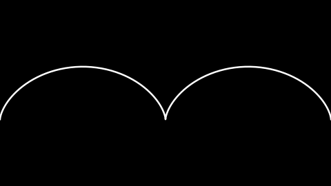
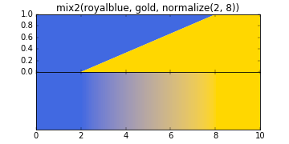
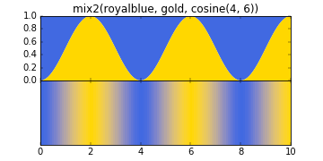
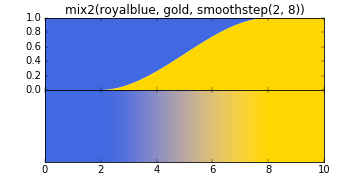
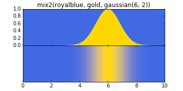
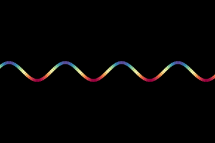

# taylor-bundles

Script for rendering Taylor Bundles

## Index

TODO

## What is a Taylor Bundle:

#### Tangent Line

Given a function f(x), a tangent line to the graph y=f(x) at the point x=a is a linear function p(x) such that f(a)=p(a) and f'(a)=p'(a). I.e. the value of the functions are equal, and the value of the first derivatives are equal. p(x) is unique for any a, and it's equation is f(a)+f'(a)(x-a).

Here's a picture of the tangent line to y = sin(x) at x=1


#### Tangent Bundle

By drawing multiple tangents at once, we can see that they form a pattern.  Here is sin(x) with 200 tangents equally spaced in the domain -4pi<x<4pi.  They form a square lattice.  Understanding why is a nice exercise for the reader.


From this picture we can intuit the concept of a _**tangent bundle:** all the tangents to a curve, in a given domain, taken together._ We can also intuit that the tangent bundle has the property of _**tangent density:** how much tangent there is around a point in the plane,_ indicated in the picture by how bright it is.  We will not attempt to give a precise definition here.

We can guess the tangent density to be continuous around every (or most) points in the plane.  By drawing very many tangents so fine that the individual lines are indistinguishable, we get an idea of what this looks like. Here is the same bundle as above, this time represented with 10,000 tangent lines.


Caveat: If we want to see the density as a property of _the curve_ rather than a property of _the function_, the curve should be reparametrized with respect to arc length. This is not currently implemented in the program, and the distinction will be glossed over for the rest of this text.


#### Taylor Polynomials

The concept of a taylor polynomial can be seen as an extension of the concept of a tangent line. Given a function f(x), the n<sup>th</sup> degree Taylor polynomial of f about the point x=a is an n<sup>th</sup> degree polynomial p(x) such that

*  p(a) = f(a)
*  p'(a) = f(a)
*  ...
*  p^(n)(a) = f^(n)(a)   <-- n<sup>th</sup> derivative equal

Again p is unique for a given a, and it's equation is sum_0^n(f^(n)(a)(x-a)^n/n!)

Here's a picture of the 2<sup>nd</sup> degree Taylor polynomial of y=sin(x) about x=1:


#### Taylor Bundles

Like we can draw many tangents together, so we can draw many Taylor polynomials. Here is an image of 10,000 2<sup>nd</sup> degree Taylor polynomials of sin(x) in the domain -4pi<x<4pi. 


Again we can see a pattern, intuit the concept of an **n<sup>th</sup> degree Taylor bundle,** having a **density**, and being continuous.

#### Parametric Curves

Given a parametric curve c(t) = \<x(t), y(t)\>, the concepts are extended as such: The n<sup>th</sup> degree Taylor curve of c(t) about t=a is \<p(t), q(t)\> where p(t) is the n<sup>th</sup> degree Taylor polynomial of x(t) about t=a, and q(t) is the n<sup>th</sup> degree Taylor polynomial of y(t) about t=a.

Here is an example of a parametric curve (an epitrochoid) with a 4<sup>th</sup> degree Taylor curve about a point: 


And here is the corresponding 4<sup>th</sup> degree Taylor bundle for the (full) domain 0<t<2pi:


## Adding Colour

Thus far the bundles have been rendred in monochrome. We can color code the Taylor curves, and thus see how much density they contribute to an area of the bundle according to their point of origin.

As an example we use this scheme. The curves originating on the "peaks" of the curve are yellow and the ones originating in the "valleys" are blue, with a gradient in between:


The bundle looks as such:


## Installation

There is currently no official release. To use the library in it's current state, just clone the repository / copy the source files into a folder. Make python find the modules either by updating pythons paths, or simply by saving and running your projects from the same folder.

#### Dependencies

This library depends on **numpy** and **matplotlib**. We don't know strictly which versions are requred. However, it is tested and works with numpy 1.9.3 and matplotlib 1.5.0rc3. It is known to not work with some older versions of both.


## Usage

The minimum work required to get an image output is to instantiate a `TaylorBundle` object, give it a `curve` argument, and run the `render()` method. All other options have a default so that the renderer works (but rarely are they all ideal for a given render.)

The easiest way to get a valid curve argument is the `fromFunction` function , exported from the the `curve` module.

#### Example Code

Minimal definition:

```Python
from taylorbundle import TaylorBundle
import curve
import numpy

tb = TaylorBundle( curve = curve.fromFunction(numpy.sin) )
tb.render()
```

For more detailed examples, see the files `example_star.py`, `example_asteroid,py`, `example_lissajous.py`. See the `renders/` folder for their output.


## Modules In Detail

The following sections have complete information on `TayloBundle`'s options, on curves, and on how to use color.


### `taylorbundle.py`

`taylorbundle` exports two names. First, the class `TaylorBundle` which specifies and renders a Taylor bundle. Second, the circle constant `tau`, because numpy only exports `pi`, and who would want to use that?

The options for a `TaylorBundle` can be set in three ways. Either give them as arguments at object creation, e.g. `tb = TaylorBundle(option=value, ...)`, or set them with the `set_options` method. E.g. `tb.set_options(option=value, ...)`, or manipulate the objet property directly, e.g. `tb.option = value`

#### TaylorBundle Options

The options fall in 3 broad categories. First the specification of the mathematical object as such. Then technical details about how to render it, in 3 sub-categories. Finally options for the file output.

###### Mathematical specification of the bundle

Option       | Default Value | Description
-------------|---------------|------------
curve        | None          | The generating curve for the bundle. 
degree       | 1             | The degree of the Taylor polynomials.
bundledomain | (0, tau)      | The domain to render tangent polynomals in.
curvedomain  | (0, tau)      | The domain to show `curve` in.
domain       | (0, tau)      | The domain of both the curve and tangent space. Setting this overwrites the values of the two domain options above.

###### Rendering of the generating curve

Option | Default Value | Description
-------|---------------|------------
showcurve  | True |  If `True`, Show the generating curve on top of the tangent bundle.
curveres   | 256  |  Resolution of generating curve
curvecol   | "w"  |  Colour of generating curve. For a list of valid color values, see the section on `colormix.py`
curvelw    | 2    |  Line width of generating curve, in points. Note this is relative to `figsize`, not resolution. (72 points to an inch)
curvealpha | None |  Transparency of generating curve. Should be a number between 0.0 (invisible) and 1.0 (opaque). If it is `None` alpha is determined by the `curvecol` argument and can be variable.

###### Rendering of the Taylor curves

Option | Default Value | Description
-------|---------------|------------
n_tan     | 200    | Number of tangents per image render.
tandomain | [-2,2] | Domain of tangent lines, where the point of tangency is 0.
tanres    | 256    | Resolution of tangent curves.
tanlw     | 0.2    | Line width of tangents, in points. Note this is relative to `figsize`, not resolution. (72 points to an inch)
tancol    | "r"    | Colour of tangents. For a list of valid color values, see the section on `colormix.py`
tanalpha  | None   | Tranparency of tangents. Should be a number between 0.0 (invisible) and 1.0 (opaque). If it is `None` alpha is determined by the `tancol` argument and can be variable.

###### Rendering of the image

Option | Default Value | Description
-------|---------------|------------
n_part    | 1             | Number of partial images to render. When drawing tens of thousands of lines to a single frame memory can be an issue. With this setting >1 the rendering is split up over multiple images which are averaged together.
facecolor | 'k'           | Background colour of plotting surface.
window    | [-16,16,-9,9] | Bounds of the plotting coordinate system (xmin, xmax, ymin, ymax).
figsize   | (16,9)        | Size of image (width, height) in inches.
dpi       | 120           | Resolution of image (dots per inch). The resolution of the rendered image is dpi*figsize.

###### Files

Option | Default Value | Description
-------|---------------|------------
filename      | None  | Name for the saved image file. If `None`, makes a file name based on current date and time.
keep_partials | False | Keep partial files after render finishes

###### Sensible options for good image quality

TODO

### `curve.py`


`curve.py` exports the following names of interest:

###### `Curve(x, y, dx=None, dy=None)`

The `curve` argument to a TaylorBundle is an instance of the `Curve` class. It has the `taylorCurve` method, which does a Taylor expansion around a given point, and allows us to draw our bundles.

The arguments `x(t)` and `y(t)` are the x and y coordinates of the curve, functions of a third independent variable. The argument and return value should both be a numpy `ndarray`.

The optional arguments `dx(t, n=1)` and `dy(t, n=1)` are the derivatives of `x` and `y` w.r.t. `t`. `n` is the order of the derivative. For drawin the n<sup>th</sup> order Taylor Bundle, the derivative funcion must be valid up to order n. Note that `dx(t, 0)` should equal `x(t)`, and similarly for `dy`.

If `dx` and `dy` are not supplied, they default to numerical differentiation (symmetric finite difference method.) The result can often be sufficient for lower order terms, e.g. `n<=3`.

###### `fromFunction(f, df=None)`

Returns a Curve instance representing the curve y=f(x).

###### `Point(x0, y0)`

A parametric point, i.e. a Curve where x(t)=x0 and y(t)=y0 for all t.

###### `Line(a, b)`

A parametric line with run `a` and rise `b`. I.e. x(t)=a\*t and y(t)=b\*t.

###### `Circle(r, omega=1.0, o=0.0)`

A parametric circle of radius `r`, argular velocity `omega` and rotational offset `o`.

###### `Epitrocohid(R, r, d, o=0.0)`

An [epitrochoid curve](https://en.wikipedia.org/wiki/Epitrochoid), where `R` is the radius of the stationary circle, `r` is the radius of the rolling circle, `d` is the distance of the traced point from the center of the rolling circle, and `o` is the rotational offset of the rolling circle.

###### `Hypotrochoid(R, r, d, o=0.0)`

A [hypotrochoid curve](https://en.wikipedia.org/wiki/Hypotrochoid), where `R` is the radius of the stationary circle, `r` is the radius of the rolling circle, `d` is the distance of the traced point from the center of the rolling circle, and `o` is the rotational offset of the rolling circle.

###### `Lissajous(a, b, A, B, delta)`

A [lissajous curve](https://en.wikipedia.org/wiki/Lissajous_curve), a complex harmonic curve where the x and y components are each a simple harmonic motion. `a` and `b` are the angular frequency of the x and y component respectively, `A` and `B` are their respective amplitude, and `delta` is the offset in phase between the components.

#### Curves as sums

Curves can be defined as sums of `Curve` instances. E.g. an epitrochoid can be defined as the sum of two circular motions. Here is an examples of a [cycloid curve](https://en.wikipedia.org/wiki/Cycloid) being defined as the sum of a linear and a circular motion:

```Python
line = curve.Line(1, 0)
circle = curve.Circle(1, -1, -tau/4)
c = line + circle
```



#### Define your own Curve classes

When investigating a family of curves it is convenient to write a class for them. This class must inherit from the `Curve` class, and an instance must have the `x`, `y`, `dx`, and `dy` properties. If you do not wish or need to write the `dx` and `dy` functions, call `Curve.__init__(self, x, y)` in your `__init__` to use the default numerical differentiation.


### `colormix.py`

A color function must take a numpy ndarray (shape `(n,)`) of curve parameter values as it's argument, and return an ndarray (shape `(n,4)`) of RGBA-values. `colormix` supplies two ways of making color functions; `colormap` and `mix2`.

`colormap` takes 2 arguments; the name of a matplotlib colormap, and a normalization function. 

`mix2` takes 3 arguments; 2 color values and a normalization function. It mixes the two colors such that when `norm` is `0` it shows color 1, and when `norm` is `1` it shows color 2. It takes an optional kwarg `linear` (by default `True`) whereby you can mix the colors in a linear color space.

A normalization function should take a numpy `ndarray` of numbers and return an `ndarray` of the same size, where each element is a float in the unit range [0,1]. If the normalized values fall outside the unit range, `colormap`/`mix2` will truncate them to `0` or `1`. 

`colormix` supplies 4 normalization functions; `normalize`, `smoothstep`, `cosine`, and `gaussian`. Here are illustrations of how they work.

 
 

and here's an example in action of using a matplotlib colormap:

```Python
c = curve.fromFunction( np.sin )
def norm(t):  # color based on the y-value of the function
    return colormix.normalize(-1,1)(sin(t))
cfun = colormix.colormap("Spectral", norm)
```

 


Valid color arguments to `mix2` are: Matplotlib color chars (e.g. `'r'`), html color names (e.g. `"gold"`), HTML hex color strings (e.g. `"#FF8F00"`), RGB-tuples (e.g. `(0,0.5,1)`), RGBA-tuples (e.g. `(0,1,0,0.5)`). It can also take other color functions, meaning you can compose mixers with eachother to create more complex behaviour.
