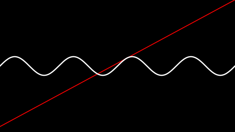
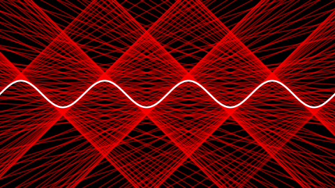

# taylor-bundles
Script for rendering Taylor Bundles

## What is a Taylor Bundle:

#### Tangent Line

Given a function f(x), a tangent line to the graph of x, in the point <a,f(a)>, is a linear function p(x) such that f(a)=p(a) and f'(a)=p'(a). I.e. the value of the functions are equal, and the value of the first derivatives are equal. p(x) is unique for any a.

Here's a picture of a few tangent lines to y = sin(x)

#### Tangent Bundle

By drawing multiple tangents at once, we can see that they form a pattern.  Here is sin(x) with 400 tangents equally spaced in the range 0<x<8pi.  They form a square lattice.  It's easy to see why; around the points where sin(x) is small, we also have that sin''(x) is small.  I.e. the rate of change of the tangent slope is small. Therefore they will "bunch up" more around those points.

From this, we can intuit the concept of a _**tangent bundle:** all the tangents to a curve, in a given range, taken together._ We can also intuit that the tangent bundle has the property of _**tangent density:** how much tangent there is around a point in the plane,_ indicated in the picture by how bright it is.

We can expect the tangent density to be continuous around every (or most) points in the plane.  By drawin very many tangents so fine that the individual lines are indistinguishable, we get an idea of what this looks like. Here is the same bundle as above, this time represented with 40,000 tangent lines.

Caveat: If we want to look at the bundle as a property of _the curve_ rather than a property of _the function_, the curve should be reparametrized with respect to arc length; The points where we draw the tangent lines should be chosen equally spaced along the curve rather than equally spaced in the parameter. However this is currently not implemented in the program, and the distinction will be glossed over for the rest of this text.

Another thing beyond the scope of the project is to give a formal definition of tangent density, such that the quantity can be calculated on a per-point basis, rather than by dumbly adding up lines. However it would be a worthwhile project to do at some point.

#### Taylor Polynomials

The concept of a taylor polynomial can be seen as an extension of the concept of a tangent line. Given a function f(x), the n'th degree Taylor polynomial of f around the point <a, f(a)> is an n'th degree polynomial p(x) such that
p(a) = f(a)
p'(a) = f(a)
p''(a) = f''(a)
...
p^(n)(a) = f^(n)(a)   <-- n'th derivative

Again p is unique for any given a.

#### Taylor Bundles

Like we can draw many tangents on top of each other, so we can draw many Taylor polynomials. Here is an image of 40,000 2nd degree taylor polynomials of sin(x) in the range 0<x<8pi. 

PICTURE HERE

Again we can see a pattern, intuit the concept of an **n'th degree Taylor bundle,** having a **density**, and being continuous.

#### Parametric Curves

Given a parametric curve c(t) = <x(t),y(t)>, the concepts are extended as such: The n'th degree Taylor polynomial around a point c(a) is <p(t),q(t)> where p(t) is the n'th degree taylor polynomial around x(a), and q(t) is the n'th degree taylor polynomial around y(a)

Here is an example of what a Taylor bundle around a parametric curve (a hypotrochoid) can look like.

PICTURE HERE

In this case, the Taylor curves are given colour based on the parameter a, where on the generating curve they originate.

## Example Renders

Here is a portfolio with examples of images this Program can generate. For the interested, I will try to include the curve parameters in the description field.

LINK TO DEVIANT ART ACCOUNT HERE

## Dependencies

this library depends on **numpy** and **matplotlib**. I don't know strictly which versions are requred. However, it is tested and works with numpy 1.9.3 and matplotlib 1.5.0rc3. It is also known to not work with numpy 1.6.2.

## Usage

#### Examples 

See the files in this project named "example\_\*.py".

MAYBE INSERT EXAMPLE CODE HERE AND EXPLAIN

OR MAYBE INSERT PROSAL COMMENTS IN THE SOURCE FILES

#### Options

EXPLAIN THE RENDERER OPTIONS HERE
    give examples
    explain the options

#### Predefined curves

PUT SOMETHING HERE

#### How to define your own curves

PUT SOMETHING HERE
    
#### Color

PUT SOMETHING HERE    

