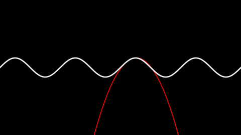
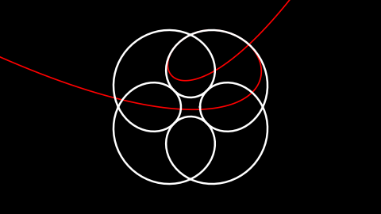
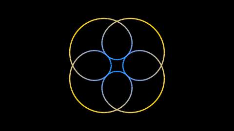
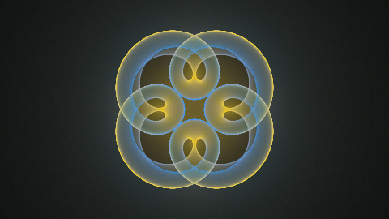

# taylor-bundles

Script for rendering Taylor Bundles

## Index

TODO

## What is a Taylor Bundle:

#### Tangent Line

Given a function f(x), a tangent line to the graph of x, in the point (a, f(a)), is a linear function p(x) such that f(a)=p(a) and f'(a)=p'(a). I.e. the value of the functions are equal, and the value of the first derivatives are equal. p(x) is unique for any a.

Here's a picture of the tangent line to y = sin(x), x=1


#### Tangent Bundle

By drawing multiple tangents at once, we can see that they form a pattern.  Here is sin(x) with 200 tangents equally spaced in the domain -4pi<x<4pi.  They form a square lattice.  It's easy to see why; around the points where sin(x) is small, we also have that sin''(x) is small.  I.e. the rate of change of the tangent slope is small. Therefore they will "bunch up" more around those points.


From this, we can intuit the concept of a _**tangent bundle:** all the tangents to a curve, in a given domain, taken together._ We can also intuit that the tangent bundle has the property of _**tangent density:** how much tangent there is around a point in the plane,_ indicated in the picture by how bright it is.

We can expect the tangent density to be continuous around every (or most) points in the plane.  By drawin very many tangents so fine that the individual lines are indistinguishable, we get an idea of what this looks like. Here is the same bundle as above, this time represented with 10,000 tangent lines.


Caveat: If we want to look at the bundle as a property of _the curve_ rather than a property of _the function_, the curve should be reparametrized with respect to arc length; The points where we draw the tangent lines should be chosen equally spaced along the curve rather than equally spaced in the parameter. However this is currently not implemented in the program, and the distinction will be glossed over for the rest of this text.

Another thing beyond the scope of the project is to give a formal definition of tangent density, such that the quantity can be defined/calculated on a per-point basis, rather than by dumbly adding up lines. However it would be a worthwhile project to do at some point.


#### Taylor Polynomials

The concept of a taylor polynomial can be seen as an extension of the concept of a tangent line. Given a function f(x), the n'th degree Taylor polynomial of f around the point <a, f(a)> is an n'th degree polynomial p(x) such that

*  p(a) = f(a)
*  p'(a) = f(a)
*  p''(a) = f''(a)
*  ...
*  p^(n)(a) = f^(n)(a)   <-- n'th derivative equal

Again p is unique for any given a. Here's a picture of the 2nd degree Taylor polynomial for y=sin(x), x=1:



#### Taylor Bundles

Like we can draw many tangents on top of each other, so we can draw many Taylor polynomials. Here is an image of 10,000 2nd degree taylor polynomials of sin(x) in the domain -4pi<x<4pi. 


Again we can see a pattern, intuit the concept of an **n'th degree Taylor bundle,** having a **density**, and being continuous.

#### Parametric Curves

Given a parametric curve c(t) = (x(t), y(t)), the concepts are extended as such: The n'th degree Taylor polynomial around a point c(a) is (p(t), q(t)) where p(t) is the n'th degree taylor polynomial around x(a), and q(t) is the n'th degree taylor polynomial around y(a).

Here is an examplem of a parametric curve (a hypotrochoid) with a 4th degree Taylor polynomial curve in a point: 



And here is the corresponding 4th degree Taylor bundle for the domain 0<t<2pi:


## Adding Colour

Thus far the bundles have been rendred in monochrome and viewed as a whole. We can color code the tangent polynomials, and by that method see how much density they contribute to an area of the bundle according to their point of origin.

For example, if we color them based on this scheme, where the polynomials originating on the "peaks" of the curve are yellow and the ones originating in the "valleys" are blue,



the bundle looks as such:




## Installation

There is currently no official release. To use the library in it's current state, just clone the repository / copy the source files into a folder. Make python find the modules either by updating pythons paths, or simply by saving and running your projects from the same folder.

#### Dependencies

This library depends on **numpy** and **matplotlib**. I don't know strictly which versions are requred. However, it is tested and works with numpy 1.9.3 and matplotlib 1.5.0rc3. It is known to not work at least one older version of matplotlib.


##Usage

## Usage

The minimum work required to get an image output is to instantiate a `TaylorBundle` object, give it a `curve` argument, and run the `render()` method. All other options have a default so that the renderer works, but rarely are they all ideal for a given render.

The easiest way to get a valid curve object is the `fromFunction` function from the `curve` module.

#### Example Code

Minimal definition:

```
from taylorbundle import TaylorBundle
import curve
import numpy

tb = TaylorBundle( curve = curve.fromFunction(numpy.sin) )
tb.render()
```

For more detailed examples, see the files `example_star.py`, `example_asteroid,py`. See the `renders/` and folder for their output. See `readme_renders.py` for how the figures in this readme were made.

The following sections have complete information on `TayloBundle`'s options, on curves, and on how to use color.


## Modules In Detail

TODO

#### `taylorbundle.py`

#### TaylorBundle Options

#### `curve.py`

#### Define Your Own Curves

#### `colormix.py`

#### Define Your Own Color Mixer
